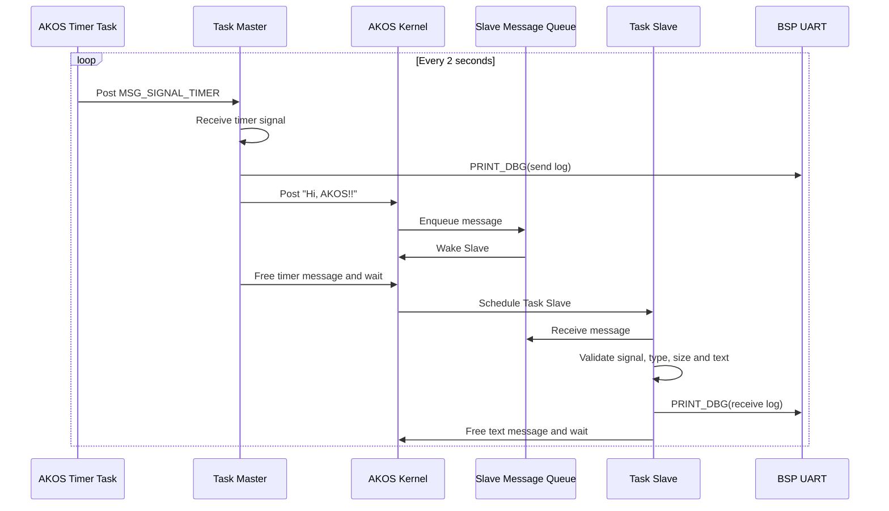

# Message example

This example demonstrates one-way AKOS message passing between two tasks. A
periodic software timer sends `MSG_SIGNAL_TIMER` to Task Master every two
seconds. Task Master then posts the null-terminated text `"Hi, AKOS!!"` to Task
Slave. Task Slave blocks on its queue, validates the signal, message type,
payload size, null terminator, and text, then prints the receive log.

All application logs use `PRINT_DBG()`, which maps to `bsp_uart_puts()`. The BSP
configures USART1 at 115200 baud. The exact TX/RX pins are documented by the
selected board BSP.



## Expected UART output

```text
[TASK MASTER] send "Hi, AKOS!!" to task Slave
[TASK SLAVE]     recv "Hi, AKOS!!" from task Master

[TASK MASTER] send "Hi, AKOS!!" to task Slave
[TASK SLAVE]     recv "Hi, AKOS!!" from task Master
```

## Build and run

Build from the repository root, selecting the required board:

```bash
make BOARD=STM32F103C8T6 EXAMPLE=message
```

Flash the generated `.hex` or `.bin` file from
`build/<BOARD>/message/` using the board's programmer. Connect a serial terminal
to USART1 at 115200 baud, 8 data bits, no parity, and one stop bit. Reset the
board and observe one send/receive pair every two seconds.
