# Message Example

This example demonstrates dynamic message passing between two AKOS threads. A periodic timer wakes the master thread, which sends a copied text payload to the slave thread for validation and processing.

## Runtime sequence

```mermaid
---
config:
  theme: base
  themeVariables:
    background: "#0f172a"
    primaryColor: "#1d4ed8"
    primaryTextColor: "#f8fafc"
    primaryBorderColor: "#60a5fa"
    lineColor: "#94a3b8"
    secondaryColor: "#334155"
    tertiaryColor: "#1e293b"
    actorBkg: "#1d4ed8"
    actorBorder: "#60a5fa"
    actorTextColor: "#f8fafc"
    actorLineColor: "#64748b"
    signalColor: "#e2e8f0"
    signalTextColor: "#f8fafc"
    labelBoxBkgColor: "#334155"
    labelBoxBorderColor: "#64748b"
    labelTextColor: "#f8fafc"
    loopTextColor: "#f8fafc"
    noteBkgColor: "#422006"
    noteBorderColor: "#fbbf24"
    noteTextColor: "#fef3c7"
    activationBkgColor: "#fbbf24"
    activationBorderColor: "#f59e0b"
---
sequenceDiagram
    participant Timer as Timer service
    participant MQ as Master queue
    participant Kernel as AKOS kernel
    participant Master as Master task
    participant SQ as Slave queue
    participant Slave as Slave task
    participant UART as Debug UART

    rect rgb(15, 23, 42)
        loop Every 2000 scheduler ticks
            activate Timer
            Timer->>MQ: Post MSG_SIGNAL_TIMER
            deactivate Timer

            activate Kernel
            MQ->>Kernel: Mark master ready
            Kernel->>Master: Schedule master
            deactivate Kernel

            activate Master
            MQ-->>Master: Receive timer message
            opt EXAMPLE_DEBUG_ENABLED
                Master->>UART: Print timer event
            end
            Master->>Kernel: Post dynamic MSG_SIGNAL_TEXT

            activate Kernel
            Kernel->>SQ: Copy MESSAGE_TEXT into a message
            Kernel-->>Slave: Wake slave
            deactivate Kernel

            Master->>Kernel: Free timer message and wait
            deactivate Master

            activate Kernel
            Kernel->>Slave: Schedule slave
            deactivate Kernel

            activate Slave
            SQ-->>Slave: Receive dynamic message
            Slave->>Slave: Check type, size, terminator, and content
            opt EXAMPLE_DEBUG_ENABLED
                Slave->>UART: Print validated payload
            end
            Slave->>Kernel: Free dynamic message and wait
            deactivate Slave
        end
    end
```



## 1. Define thread IDs, signals, and payload

Declare the sender, receiver, timer signal, application signal, and message content in `inc/main.h`:

```c
#define MESSAGE_TEXT      "Hi, AKOS!!"
#define MESSAGE_PERIOD_MS 2000u

enum APP_THREAD_ID {
    THREAD_MASTER_ID = 0,
    THREAD_SLAVE_ID
};

enum APP_MESSAGE_SIGNAL {
    MSG_SIGNAL_TIMER = 1,
    MSG_SIGNAL_TEXT
};
```

## 2. Register the master and slave threads

```c
AKOS_THREAD_DEFINE(master, THREAD_MASTER_ID, task_master, NULL, 1u, 4u,
                   APP_TASK_STACK_SIZE);
AKOS_THREAD_DEFINE(slave, THREAD_SLAVE_ID, task_slave, NULL, 2u, 4u,
                   APP_TASK_STACK_SIZE);
```

The master has priority `1u`, the slave has priority `2u`, and each thread owns a four-message queue.

## 3. Wake the master with a periodic timer

The master creates a periodic timer whose destination is the master thread itself:

```c
ak_timer_t* timer = akos_timer_create(0u, MSG_SIGNAL_TIMER, NULL, THREAD_MASTER_ID,
                                      MESSAGE_PERIOD_MS, TIMER_PERIODIC);

if (timer != NULL) {
    akos_timer_start(timer, MESSAGE_PERIOD_MS);
}
```

## 4. Send a dynamic message

When `MSG_SIGNAL_TIMER` arrives, the master sends the text and its complete size to the slave:

```c
akos_thread_post_msg_dynamic(THREAD_SLAVE_ID, MSG_SIGNAL_TEXT, MESSAGE_TEXT,
                             (uint8_t)sizeof(MESSAGE_TEXT));
```

`sizeof(MESSAGE_TEXT)` includes the trailing null character. AKOS copies the supplied payload into the dynamic message, so the receiver does not depend on the sender's buffer lifetime.

## 5. Read and validate the payload

The slave accepts only the expected signal and dynamic message type, then obtains the payload and its stored size:

```c
if ((message->sig == MSG_SIGNAL_TEXT) && (message->type == MSG_TYPE_DYNAMIC)) {
    uint8_t payload_size = 0u;
    char* payload = akos_message_get_dynamic_data(message, &payload_size);

    if ((payload != NULL) && (payload_size == (uint8_t)sizeof(MESSAGE_TEXT)) &&
        (payload[payload_size - 1u] == '\0') &&
        (memcmp(payload, MESSAGE_TEXT, sizeof(MESSAGE_TEXT)) == 0)) {
        /* The payload is valid. */
    }
}
```

After processing, both tasks must release every received message:

```c
akos_message_free(message);
```

## 6. Initialize AKOS and start scheduling

```c
int main(void) {
    bsp_init();
    akos_core_init();
    akos_core_run();

    while (true) {
    }
}
```

## Build

From the repository root:

```sh
make BOARD=AK_BASE_KIT_V2_3 EXAMPLE=message
```
