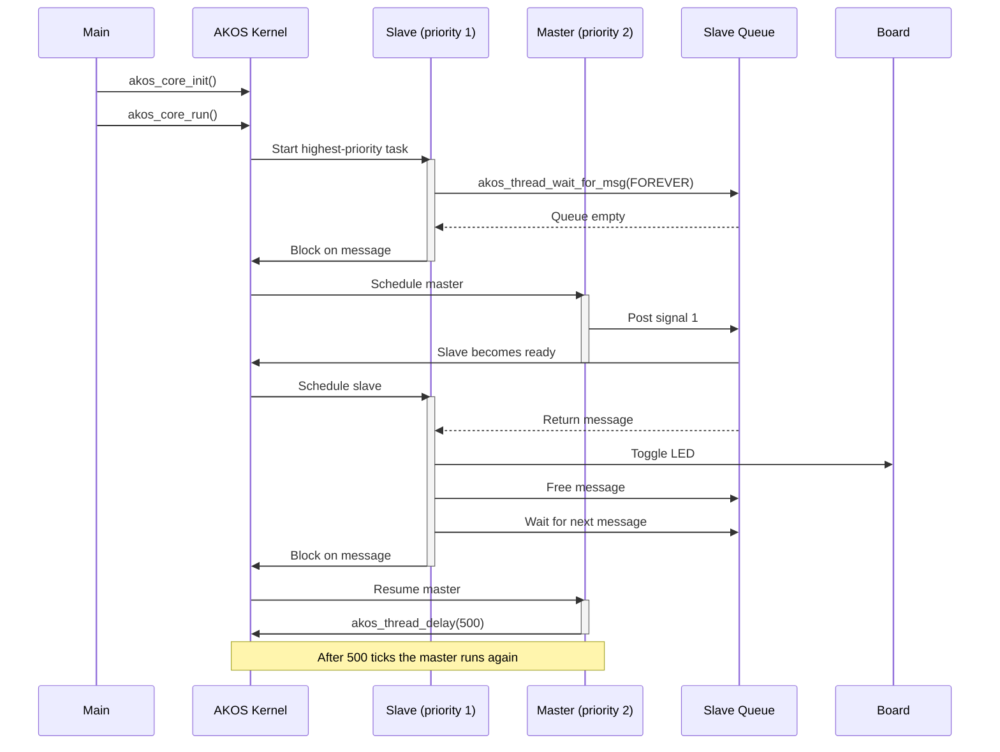

# Message example

The higher-priority slave waits for a signal. The master posts one signal every
500 ticks, waking the slave to toggle the LED and release the message.
The activation bar shows which task is currently running.

