# Priority Example

This example demonstrates how AKOS schedules ready threads according to their priorities. Two threads receive periodic timer signals, but the high-priority thread is scheduled first whenever both threads become ready at the same time.

## Runtime sequence

```mermaid
---
config:
  theme: base
  themeVariables:
    background: "#0f172a"
    primaryColor: "#1d4ed8"
    primaryTextColor: "#f8fafc"
    primaryBorderColor: "#60a5fa"
    lineColor: "#94a3b8"
    secondaryColor: "#334155"
    tertiaryColor: "#1e293b"
    actorBkg: "#1d4ed8"
    actorBorder: "#60a5fa"
    actorTextColor: "#f8fafc"
    actorLineColor: "#64748b"
    signalColor: "#e2e8f0"
    signalTextColor: "#f8fafc"
    labelBoxBkgColor: "#334155"
    labelBoxBorderColor: "#64748b"
    labelTextColor: "#f8fafc"
    loopTextColor: "#f8fafc"
    noteBkgColor: "#422006"
    noteBorderColor: "#fbbf24"
    noteTextColor: "#fef3c7"
    activationBkgColor: "#fbbf24"
    activationBorderColor: "#f59e0b"
---
sequenceDiagram
    participant Timer as Timer service
    participant HQ as High queue
    participant Kernel as AKOS kernel
    participant High as High task (priority 1)
    participant LQ as Low queue
    participant Low as Low task (priority 2)
    participant LED as Board LED
    participant UART as Debug UART

    rect rgb(15, 23, 42)
        Note over Timer,Low: At tick 1000, both periodic timers expire
        activate Timer
        Timer->>HQ: Post MSG_SIGNAL_PRIO_HIGH
        Timer->>LQ: Post MSG_SIGNAL_PRIO_LOW
        deactivate Timer

        activate Kernel
        HQ->>Kernel: Mark high task ready
        LQ->>Kernel: Mark low task ready
        Kernel->>High: Schedule the highest-priority ready task
        deactivate Kernel

        activate High
        HQ-->>High: Receive timer message
        High->>LED: bsp_led_toggle()
        opt EXAMPLE_DEBUG_ENABLED
            High->>UART: Print high-priority event
        end
        High->>Kernel: Free message and wait
        deactivate High

        activate Kernel
        Kernel->>Low: Schedule the next ready task
        deactivate Kernel

        activate Low
        LQ-->>Low: Receive timer message
        opt EXAMPLE_DEBUG_ENABLED
            Low->>UART: Print low-priority event
        end
        Low->>Kernel: Free message and wait
        deactivate Low
    end
```



The smaller priority number represents the higher priority. The high task therefore runs before the low task when both are ready.

## 1. Define thread IDs, signals, and periods

Declare a unique thread ID and timer signal for each task in `inc/main.h`:

```c
#define HIGH_TASK_PERIOD_MS 100u
#define LOW_TASK_PERIOD_MS  1000u

enum APP_THREAD_ID {
    THREAD_PRIO_HIGH_ID = 0,
    THREAD_PRIO_LOW_ID
};

enum APP_MESSAGE_SIGNAL {
    MSG_SIGNAL_PRIO_HIGH = 1,
    MSG_SIGNAL_PRIO_LOW
};
```

## 2. Register threads with different priorities

Register both task entry functions in `src/main.c`:

```c
AKOS_THREAD_DEFINE(prio_high, THREAD_PRIO_HIGH_ID, task_prio_high, NULL, 1u, 4u,
                   APP_TASK_STACK_SIZE);
AKOS_THREAD_DEFINE(prio_low, THREAD_PRIO_LOW_ID, task_prio_low, NULL, 2u, 4u,
                   APP_TASK_STACK_SIZE);
```

| Parameter | High task | Low task | Purpose |
|---|---:|---:|---|
| Thread ID | `THREAD_PRIO_HIGH_ID` | `THREAD_PRIO_LOW_ID` | Identifies the message destination |
| Entry | `task_prio_high` | `task_prio_low` | Function executed by the thread |
| Priority | `1u` | `2u` | Selects which ready thread runs first |
| Queue size | `4u` | `4u` | Reserves four incoming message slots |
| Stack size | `APP_TASK_STACK_SIZE` | `APP_TASK_STACK_SIZE` | Reserves the task stack |

## 3. Create and start each periodic timer

Each task creates a timer that posts its own signal back to its own queue:

```c
ak_timer_t* timer = akos_timer_create(0u, MSG_SIGNAL_PRIO_HIGH, NULL,
                                      THREAD_PRIO_HIGH_ID, HIGH_TASK_PERIOD_MS,
                                      TIMER_PERIODIC);

if (timer != NULL) {
    akos_timer_start(timer, HIGH_TASK_PERIOD_MS);
}
```

The low-priority task uses the same pattern with `MSG_SIGNAL_PRIO_LOW`, `THREAD_PRIO_LOW_ID`, and `LOW_TASK_PERIOD_MS`.

## 4. Wait for, process, and release messages

Keep each task blocked until its timer message arrives. Always return a received message to the AKOS pool after handling it:

```c
while (true) {
    msg_t* message = akos_thread_wait_for_msg(OS_CFG_DELAY_MAX);

    if (message != NULL) {
        if (message->sig == MSG_SIGNAL_PRIO_HIGH) {
            bsp_led_toggle();
        }

        akos_message_free(message);
    }
}
```

## 5. Initialize AKOS and start scheduling

```c
int main(void) {
    bsp_init();
    akos_core_init();
    akos_core_run();

    while (true) {
    }
}
```

`akos_core_run()` starts the scheduler and normally does not return.

## Build

From the repository root:

```sh
make BOARD=AK_BASE_KIT_V2_3 EXAMPLE=priority
```
