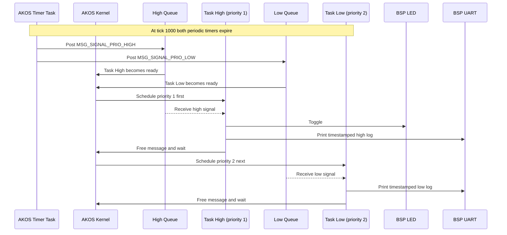

# Priority example

This example demonstrates AKOS priority scheduling with two independent tasks:

- Task High has priority 1 and receives a periodic signal every 100 ticks.
- Task Low has priority 2 and receives a periodic signal every 1000 ticks.

A smaller priority number means a higher scheduling priority. When both tasks
receive a timer signal together, AKOS runs Task High first. Both tasks block on
their message queues between signals. All logs use the common `PRINT_DBG()`
helper and BSP UART at 115200 baud.



Build from the repository root:

```bash
make BOARD=STM32F103C8T6 EXAMPLE=priority
```
