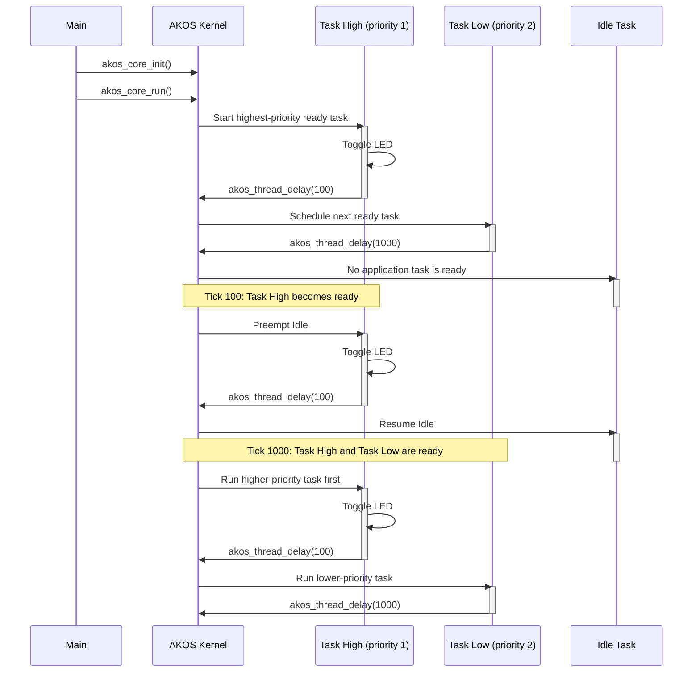

# Priority example

Task High has priority 1 and Task Low has priority 2. AKOS always schedules the
ready task with the smaller priority value first.
The activation bar shows which task is currently running.

