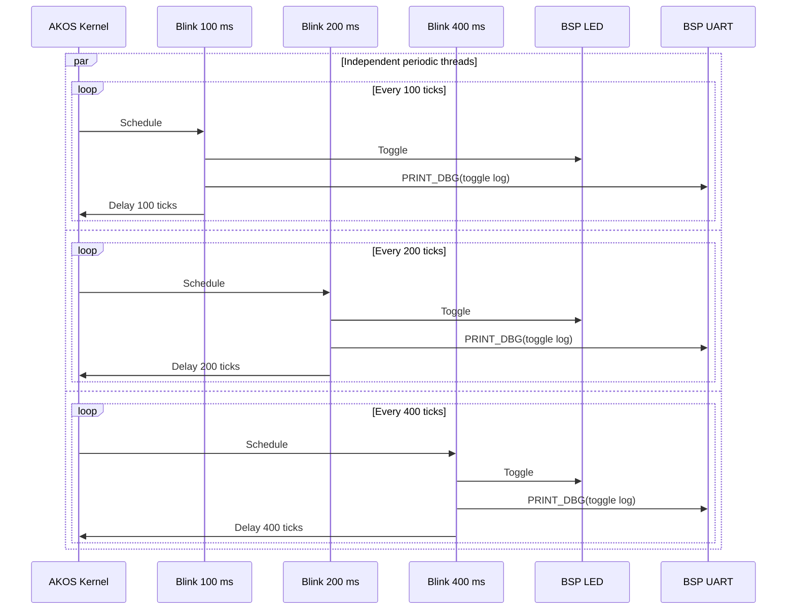

# Thread example

This example follows the AKOS `00-blink` behavior: three independent thread
descriptors run one shared `blink_task()` with different context objects. The
contexts select periods of 100, 200, and 400 scheduler ticks.

The current portable BSP exposes one board LED, so all three task instances
toggle that LED. Each action is logged through the common `PRINT_DBG()` helper
and BSP UART at 115200 baud.



Build from the repository root:

```bash
make BOARD=STM32F103C8T6 EXAMPLE=thread
```
