# Thread example

This guide shows how to create and start static tasks in AKOS.

## Runtime sequence

The scheduler runs three instances of `blink_task()`. Each instance uses its
own context, priority, and delay period, while all three toggle the BSP LED.

```mermaid
---
config:
  theme: base
  themeVariables:
    background: '#0f172a'
    primaryColor: '#1d4ed8'
    primaryTextColor: '#f8fafc'
    primaryBorderColor: '#60a5fa'
    secondaryColor: '#fbbf24'
    secondaryTextColor: '#0f172a'
    secondaryBorderColor: '#f59e0b'
    tertiaryColor: '#334155'
    tertiaryTextColor: '#f8fafc'
    tertiaryBorderColor: '#94a3b8'
    lineColor: '#cbd5e1'
    textColor: '#f8fafc'
    actorBkg: '#1d4ed8'
    actorBorder: '#60a5fa'
    actorTextColor: '#f8fafc'
    actorLineColor: '#94a3b8'
    signalColor: '#cbd5e1'
    signalTextColor: '#f8fafc'
    labelBoxBkgColor: '#334155'
    labelBoxBorderColor: '#94a3b8'
    labelTextColor: '#f8fafc'
    loopTextColor: '#f8fafc'
    activationBkgColor: '#fbbf24'
    activationBorderColor: '#f59e0b'
---
sequenceDiagram
    participant Kernel as AKOS Scheduler
    participant T100 as Blink 100 ticks (priority 4)
    participant T200 as Blink 200 ticks (priority 5)
    participant T400 as Blink 400 ticks (priority 6)
    participant LED as BSP LED
    participant UART as BSP UART

    rect rgb(15, 23, 42)
        par 100-tick task
            loop Every 100 ticks
                activate Kernel
                Kernel->>T100: Schedule ready task
                deactivate Kernel
                activate T100
                T100->>LED: bsp_led_toggle()
                opt THREAD_TASK_LOG_ENABLED
                    T100->>UART: PRINT_DBG(toggle log)
                end
                T100->>Kernel: akos_thread_delay(100)
                deactivate T100
            end
        and 200-tick task
            loop Every 200 ticks
                activate Kernel
                Kernel->>T200: Schedule ready task
                deactivate Kernel
                activate T200
                T200->>LED: bsp_led_toggle()
                opt THREAD_TASK_LOG_ENABLED
                    T200->>UART: PRINT_DBG(toggle log)
                end
                T200->>Kernel: akos_thread_delay(200)
                deactivate T200
            end
        and 400-tick task
            loop Every 400 ticks
                activate Kernel
                Kernel->>T400: Schedule ready task
                deactivate Kernel
                activate T400
                T400->>LED: bsp_led_toggle()
                opt THREAD_TASK_LOG_ENABLED
                    T400->>UART: PRINT_DBG(toggle log)
                end
                T400->>Kernel: akos_thread_delay(400)
                deactivate T400
            end
        end
    end
```



## 1. Define the task context

Use a context structure to pass configuration to the task entry function:

```c
typedef struct {
    const char* name;
    uint32_t delay_ticks;
} blink_task_ctx_t;
```

## 2. Create a context object

Each task instance can use a different context while sharing the same entry
function:

```c
static const blink_task_ctx_t blink_100ms_ctx = {
    .name        = "BLINK 100MS",
    .delay_ticks = 100u,
};
```

Create additional context objects when more task instances are required:

```c
static const blink_task_ctx_t blink_200ms_ctx = {
    .name        = "BLINK 200MS",
    .delay_ticks = 200u,
};

static const blink_task_ctx_t blink_400ms_ctx = {
    .name        = "BLINK 400MS",
    .delay_ticks = 400u,
};
```

## 3. Implement the task entry function

An AKOS task entry receives one `void*` argument. Cast it back to the expected
context type, perform the task work, and call a blocking AKOS API such as
`akos_thread_delay()` inside the loop:

Declare the entry function in the shared header so the task descriptor can
reference it:

```c
void blink_task(void* p_arg);
```

Implement the entry function in the task source file:

```c
void blink_task(void* p_arg) {
    const blink_task_ctx_t* context = (const blink_task_ctx_t*)p_arg;

    while (true) {
        bsp_led_toggle();
        akos_thread_delay(context->delay_ticks);
    }
}
```

The task function should normally not return.

## 4. Register the static task

Use `AKOS_THREAD_DEFINE()` to place a task descriptor in the AKOS task section:

```c
AKOS_THREAD_DEFINE(blink_100ms, 0u, blink_task, &blink_100ms_ctx, 4u, 0u,
                   THREAD_TASK_STACK_SIZE);
```

The macro parameters are:

| Parameter | Purpose |
|---|---|
| `blink_100ms` | Name of the generated static task descriptor. |
| `0u` | Application task ID. IDs must be unique and contiguous from `0` to `N - 1`. |
| `blink_task` | Task entry function. |
| `&blink_100ms_ctx` | Argument passed to the task entry function. Use `NULL` when no argument is needed. |
| `4u` | Task priority. A lower value means a higher priority. |
| `0u` | Message queue capacity. Use `0u` when the task does not receive messages. |
| `THREAD_TASK_STACK_SIZE` | Stack size in 32-bit words. |

Register the other task instances with their own ID, context, and priority:

```c
AKOS_THREAD_DEFINE(blink_200ms, 1u, blink_task, &blink_200ms_ctx, 5u, 0u,
                   THREAD_TASK_STACK_SIZE);
AKOS_THREAD_DEFINE(blink_400ms, 2u, blink_task, &blink_400ms_ctx, 6u, 0u,
                   THREAD_TASK_STACK_SIZE);
```

Static task descriptors are discovered automatically by
`akos_core_init()`. No separate task creation call is required in `main()`.

## 5. Initialize AKOS and start the scheduler

Initialize the board first, initialize AKOS, and then start the scheduler:

```c
int main(void) {
    bsp_init();
    akos_core_init();
    akos_core_run();

    while (true) {
    }
}
```

`akos_core_run()` starts the first task and should not return.

## Build

From the repository root:

```bash
make BOARD=AK_BASE_KIT_V2_3 EXAMPLE=thread
```
