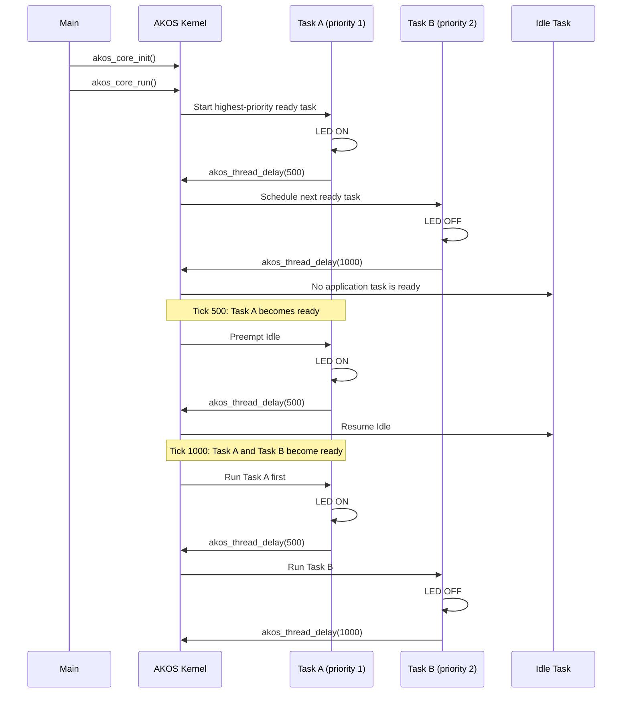

# Thread example

This example runs two periodic tasks. Task A has higher priority than Task B;
in AKOS, a smaller priority value means a higher scheduling priority.

```mermaid
sequenceDiagram
    participant Main
    participant Kernel as AKOS Kernel
    participant A as Task A (priority 1)
    participant B as Task B (priority 2)
    participant Idle as Idle Task

    Main->>Kernel: akos_core_init()
    Main->>Kernel: akos_core_run()

    Kernel->>A: Start highest-priority ready task
    A->>A: LED ON
    A->>Kernel: akos_thread_delay(500)

    Kernel->>B: Schedule next ready task
    B->>B: LED OFF
    B->>Kernel: akos_thread_delay(1000)

    Kernel->>Idle: No application task is ready

    Note over Kernel,A: Tick 500: Task A becomes ready
    Kernel->>A: Preempt Idle
    A->>A: LED ON
    A->>Kernel: akos_thread_delay(500)
    Kernel->>Idle: Resume Idle

    Note over Kernel,A: Tick 1000: Task A and Task B become ready
    Kernel->>A: Run Task A first
    A->>A: LED ON
    A->>Kernel: akos_thread_delay(500)
    Kernel->>B: Run Task B
    B->>B: LED OFF
    B->>Kernel: akos_thread_delay(1000)
```
