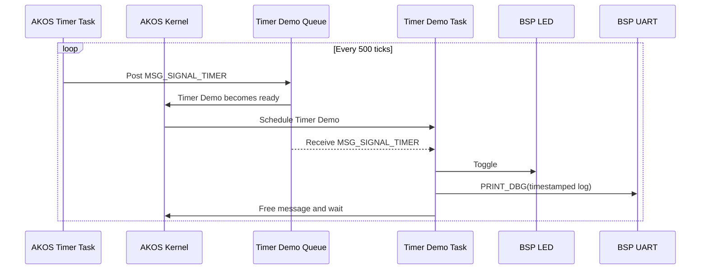

# Timer example

This example creates a periodic AKOS software timer with a 500-tick period.
Every expiration posts `MSG_SIGNAL_TIMER` to the Timer Demo task. The task
blocks on its message queue, selects `MSG_SIGNAL_TIMER`, toggles the BSP LED,
prints a timestamped log through `PRINT_DBG()`, frees the message, and waits
again.



Build from the repository root:

```bash
make BOARD=STM32F103C8T6 EXAMPLE=timer
```
