# Timer Example

This example demonstrates a periodic AKOS software timer. Every 500 scheduler ticks, the timer posts a signal to one application thread, which toggles the board LED and optionally prints a timestamp.

## Runtime sequence

```mermaid
---
config:
  theme: base
  themeVariables:
    background: "#0f172a"
    primaryColor: "#1d4ed8"
    primaryTextColor: "#f8fafc"
    primaryBorderColor: "#60a5fa"
    lineColor: "#94a3b8"
    secondaryColor: "#334155"
    tertiaryColor: "#1e293b"
    actorBkg: "#1d4ed8"
    actorBorder: "#60a5fa"
    actorTextColor: "#f8fafc"
    actorLineColor: "#64748b"
    signalColor: "#e2e8f0"
    signalTextColor: "#f8fafc"
    labelBoxBkgColor: "#334155"
    labelBoxBorderColor: "#64748b"
    labelTextColor: "#f8fafc"
    loopTextColor: "#f8fafc"
    noteBkgColor: "#422006"
    noteBorderColor: "#fbbf24"
    noteTextColor: "#fef3c7"
    activationBkgColor: "#fbbf24"
    activationBorderColor: "#f59e0b"
---
sequenceDiagram
    participant Timer as Timer service
    participant Queue as Task queue
    participant Kernel as AKOS kernel
    participant Task as Timer demo task
    participant LED as Board LED
    participant UART as Debug UART

    rect rgb(15, 23, 42)
        loop Every 500 scheduler ticks
            activate Timer
            Timer->>Queue: Post MSG_SIGNAL_TIMER
            deactivate Timer

            activate Kernel
            Queue->>Kernel: Mark timer demo task ready
            Kernel->>Task: Schedule task
            deactivate Kernel

            activate Task
            Queue-->>Task: Receive timer message
            Task->>LED: bsp_led_toggle()
            opt EXAMPLE_DEBUG_ENABLED
                Task->>UART: Print timer timestamp
            end
            Task->>Kernel: Free message and wait
            deactivate Task
        end
    end
```



## 1. Define the thread ID, signal, and period

Declare the timer period and identifiers in `inc/main.h`:

```c
#define TIMER_PERIOD_MS 500u

enum APP_THREAD_ID {
    THREAD_TIMER_DEMO_ID = 0
};

enum APP_MESSAGE_SIGNAL {
    MSG_SIGNAL_TIMER = 1
};
```

## 2. Register the timer demo thread

```c
AKOS_THREAD_DEFINE(timer_demo, THREAD_TIMER_DEMO_ID, task_timer_demo, NULL, 2u,
                   4u, APP_TASK_STACK_SIZE);
```

| Parameter | Value | Purpose |
|---|---|---|
| Thread ID | `THREAD_TIMER_DEMO_ID` | Selects the timer message destination |
| Entry | `task_timer_demo` | Handles each timer signal |
| Priority | `2u` | Sets the thread scheduling priority |
| Queue size | `4u` | Reserves four incoming message slots |
| Stack size | `APP_TASK_STACK_SIZE` | Reserves the task stack |

## 3. Create the periodic timer

Create the timer inside the task entry function:

```c
ak_timer_t* timer = akos_timer_create(0u, MSG_SIGNAL_TIMER, NULL,
                                      THREAD_TIMER_DEMO_ID, TIMER_PERIOD_MS,
                                      TIMER_PERIODIC);
```

| Argument | Value | Purpose |
|---|---|---|
| Timer ID | `0u` | Identifies the timer object |
| Signal | `MSG_SIGNAL_TIMER` | Identifies the generated event |
| Callback | `NULL` | Delivers the event through a thread message |
| Destination | `THREAD_TIMER_DEMO_ID` | Selects the receiving thread |
| Period | `TIMER_PERIOD_MS` | Reloads the timer every 500 ticks |
| Type | `TIMER_PERIODIC` | Repeats until the timer is stopped |

## 4. Start the timer

Check that allocation succeeded before starting the timer:

```c
if (timer != NULL) {
    akos_timer_start(timer, TIMER_PERIOD_MS);
}
```

The second argument is the initial delay. This example uses the same value as the repeating period.

## 5. Wait for and process timer messages

```c
while (true) {
    msg_t* message = akos_thread_wait_for_msg(OS_CFG_DELAY_MAX);

    if (message != NULL) {
        if (message->sig == MSG_SIGNAL_TIMER) {
            bsp_led_toggle();
        }

        akos_message_free(message);
    }
}
```

Waiting with `OS_CFG_DELAY_MAX` keeps the task blocked without consuming CPU time. Freeing the message returns it to the AKOS message pool.

## 6. Initialize AKOS and start scheduling

```c
int main(void) {
    bsp_init();
    akos_core_init();
    akos_core_run();

    while (true) {
    }
}
```

## Build

From the repository root:

```sh
make BOARD=AK_BASE_KIT_V2_3 EXAMPLE=timer
```
