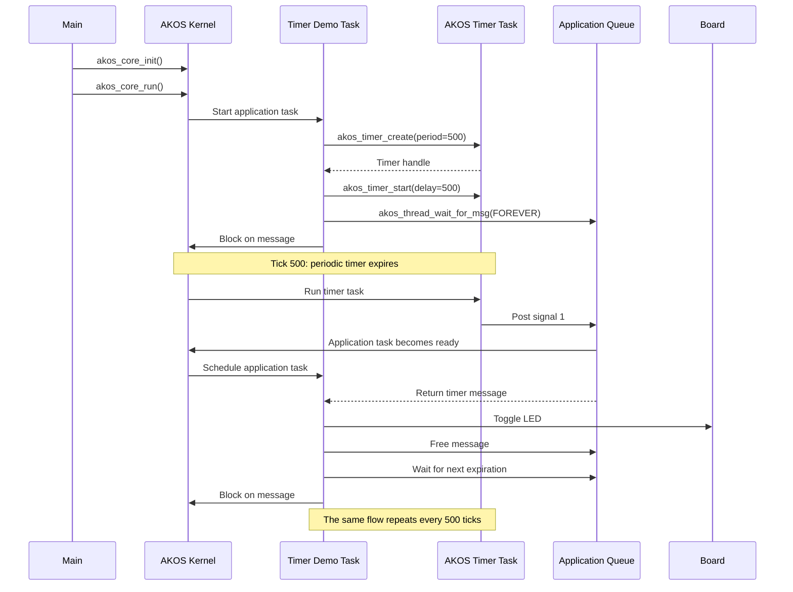

# Timer example

The application creates a periodic 500-tick timer. Each expiration posts a
signal to the application task, which toggles the LED and waits again.

```mermaid
sequenceDiagram
    participant Main
    participant Kernel as AKOS Kernel
    participant App as Timer Demo Task
    participant Timer as AKOS Timer Task
    participant Queue as Application Queue
    participant Board

    Main->>Kernel: akos_core_init()
    Main->>Kernel: akos_core_run()

    Kernel->>App: Start application task
    App->>Timer: akos_timer_create(period=500)
    Timer-->>App: Timer handle
    App->>Timer: akos_timer_start(delay=500)
    App->>Queue: akos_thread_wait_for_msg(FOREVER)
    App->>Kernel: Block on message

    Note over Kernel,Timer: Tick 500: periodic timer expires
    Kernel->>Timer: Run timer task
    Timer->>Queue: Post signal 1
    Queue->>Kernel: Application task becomes ready
    Kernel->>App: Schedule application task
    Queue-->>App: Return timer message
    App->>Board: Toggle LED
    App->>Queue: Free message
    App->>Queue: Wait for next expiration
    App->>Kernel: Block on message

    Note over Timer,App: The same flow repeats every 500 ticks
```
